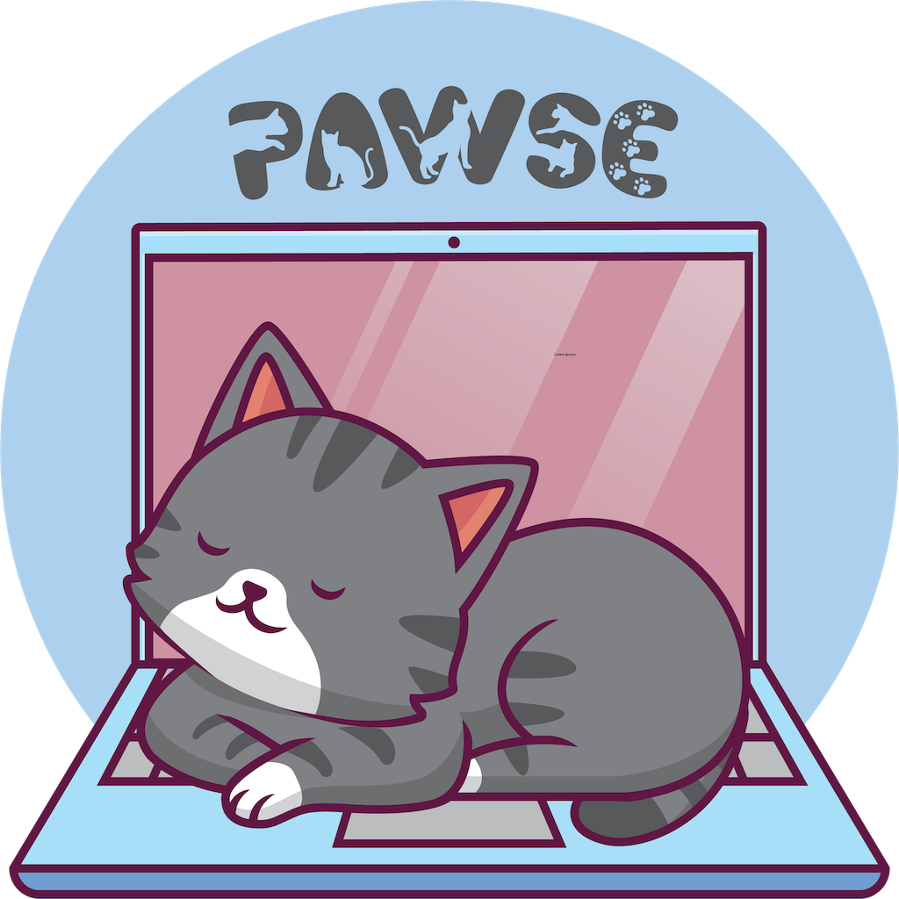

:cat2: Pawse :keyboard: :cat2:
===

A simple utility app for macOS that locks the screen when a cat is detected on the keyboard by checking if at least 3 adjacent keys are pressed simultaneously.

I got my first cat a week ago and have not had a chance to test this extensively, so I welcome any willing beta purrticipants. 
